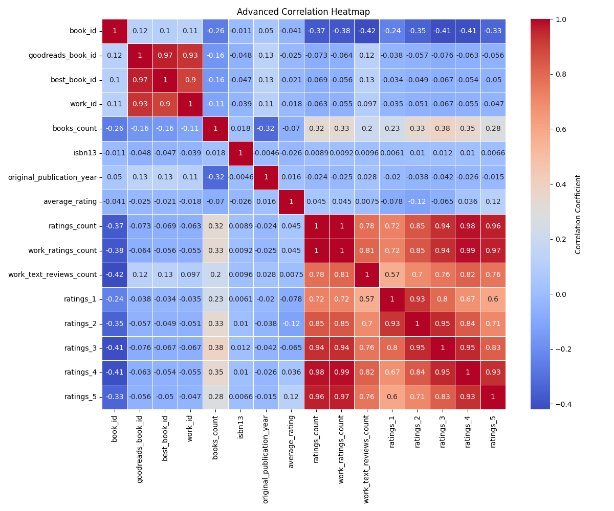
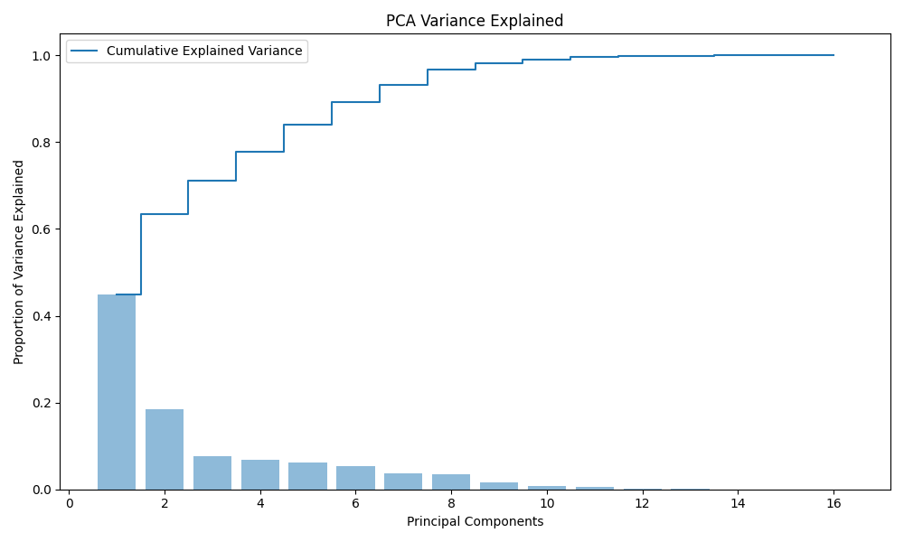
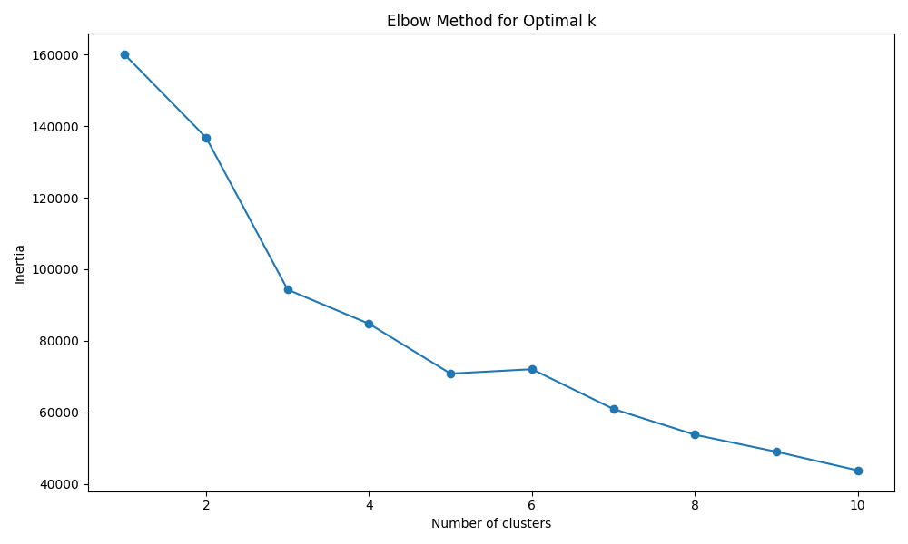
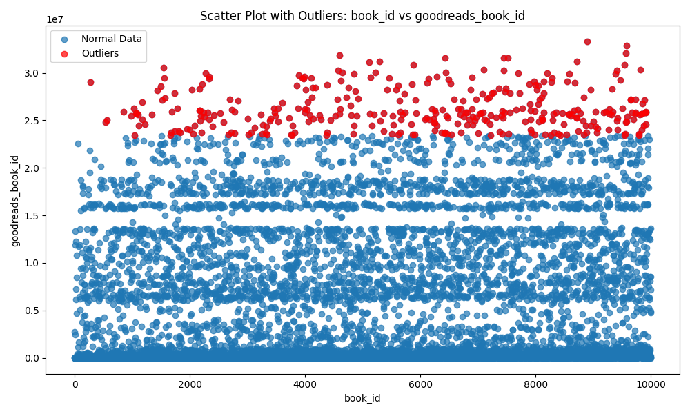

### Unveiling the Book Universe: A Deep Dive into Literary Profiles

#### Introduction

In a world increasingly captivated by the written word, the importance of understanding literary trends and reader preferences cannot be overstated. This dataset, comprising 10,000 unique books, presents a treasure trove of information for analysts, publishers, and avid readers alike. With 23 descriptive columns ranging from book identifiers to ratings and authorship, the dataset is set to illuminate patterns of literary attraction and critique across various demographics and genres. 

#### Analysis Overview

To extract meaningful insights from this comprehensive dataset, a multifaceted analytical approach was employed. The process included correlation analysis, Principal Component Analysis (PCA), clustering techniques, and an outlier detection framework:

1. **Correlation Analysis**: By examining the relationships between various variables, we sought to determine how aspects like ratings and review counts influence a book’s popularity. The accompanying visualization, **advanced_correlation_heatmap.png**, showcases these intricate connections, providing a visual reference for hypothesized relationships.

2. **Principal Component Analysis (PCA)**: To reduce the dimensionality of our dataset while retaining substantial informational content, PCA was executed. The variance plot displayed in **pca_variance_plot.png** indicates that the first two components alone account for 63.3% of the variance in the dataset. This reduction paves the way for more efficient data processing and analysis.

3. **Clustering with K-Means**: Delving deeper into the dataset's structure, K-Means clustering was applied to discern natural groupings among the books. The **kmeans_elbow_plot.png** illustrates how, upon evaluating inertia, it’s evident that optimal clusters can be determined around 4-5 groups. This insightful understanding allows publishers to target niches and tailor their offerings accordingly.

4. **Outlier Detection**: Further inspection revealed certain books that deviate significantly from their peers in terms of ratings and reviews, as illustrated in **scatter_outliers_colX_vs_colY.png**. Identifying these outliers could lead to fruitful discussions on what makes a particular title resonate—or fail—with readers.

#### Key Insights

From the rigorous analysis, several key insights emerged that hold actionable potential:

- **Audience Preferences**: Correlation analysis indicates a strong positive relationship between the number of ratings a book receives and its average rating. This insight suggests that books deeply engaged with readers are often perceived more favorably, emphasizing the importance of reader interaction for authors and marketers.

- **Diverse Offerings**: The PCA results indicate diversity in literary themes and styles, suggesting that successful books often encapsulate a broad range of genres and reader experiences. Thus, content creators are encouraged to explore thematic variations to capture wider audiences.

- **Market Positioning**: The clustering analysis highlights distinct groups, potentially signifying target demographic gaps. Publishers can utilize this to develop marketing strategies tailored to specific reader clusters, optimizing promotional efforts and inventory management.

- **Outliers as Opportunities**: The outlier detection revealed books that, despite unusual patterns in ratings or reviews, can offer unique insights into authorship styles or market misalignment. Targeting and analyzing these can lead to innovative publisher approaches or grassroots marketing strategies focusing on undervalued works.

#### Implications and Recommendations

This dataset stands as a critical resource for stakeholders in the literary ecosystem. The implications stemming from the analysis are profound: 

- **Targeted Content Creation**: Authors and publishers should leverage identified audience preferences to steer future literary projects, ensuring relevance and enhancing market fit.

- **Data-Driven Marketing**: Utilize clustering insights to inform targeted advertising campaigns, reaching specific reader demographics that engage the most with particular genres.

- **Engagement Strategies**: Considering the positive correlation between ratings and reader engagement, strategies to elevate interaction—such as book clubs, social media campaigns, or author Q&As—should be prioritized to boost visibility and reader loyalty.

In conclusion, this dataset serves as a mirror reflecting the dynamics of the book industry. By employing thoughtful analysis, stakeholders can craft compelling narratives and strategies that resonate deeply with audiences, ensuring their contributions to the literary world are not only heard but also cherished.

## Detailed Visualizations
### Dataset Overview Visualization

### PCA Variance Plot
This plot shows the explained variance ratio for principal components:

### K-Means Elbow Plot
The elbow method visualization for determining the optimal number of clusters:

### Scatter Plot with Outliers
Outliers detected between book_id and goodreads_book_id are highlighted:

