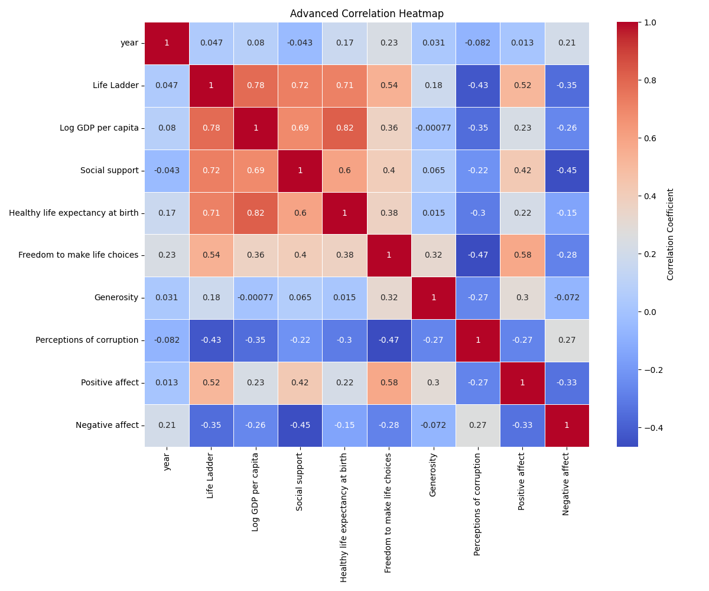
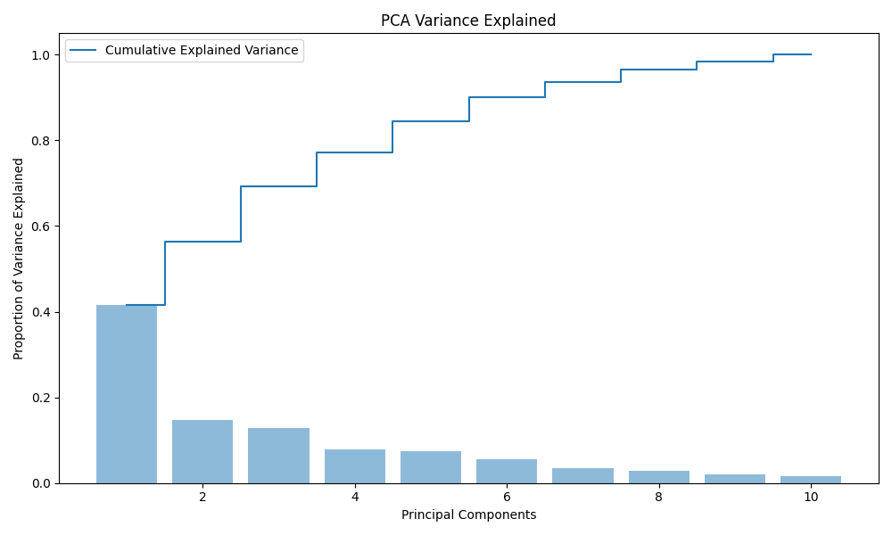
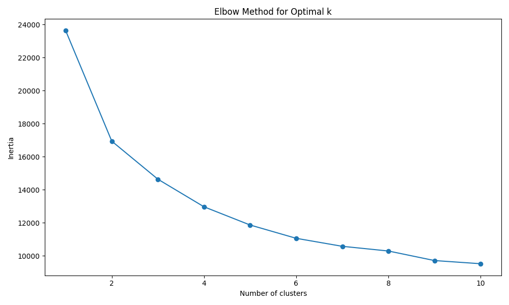
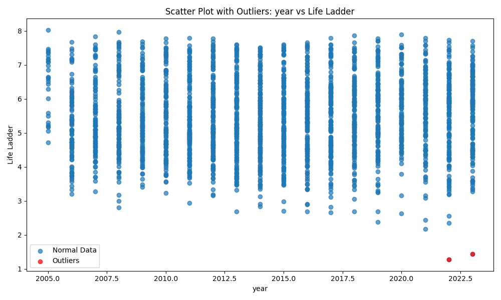

### Unveiling Global Well-Being: Insights from the Happiness and Life Quality Dataset

In a world where understanding the factors contributing to well-being is more crucial than ever, this dataset emerges as a vital tool for researchers, policymakers, and organizations alike. With 2,363 observations spanning 19 years and comprising 11 attributes, this dataset meticulously captures aspects of life across 165 countries. It encompasses critical variables such as the Life Ladder score—a measure of subjective well-being—and several socio-economic indicators like GDP per capita, social support, and perceptions of corruption. This dataset offers an opportunity to delve into the multifaceted nature of happiness and its determinants globally.

### Analysis Overview

To untangle the complexities of well-being as indicated by the data, a comprehensive analytical approach was employed. The analysis began with **correlation studies**, unveiling the interdependencies among various attributes. Using **Principal Component Analysis (PCA)**, we distilled the essence of the dataset, identifying the components that explain the greatest variance in life satisfaction. This was complemented by **clustering techniques**, specifically the KMeans algorithm, to classify countries into different groups based on similar characteristics. Additionally, **outlier detection** identified countries that deviate significantly from the overall trends, allowing us to address anomalies that might skew our conclusions.

The findings from these analyses were then visualized for clearer interpretation. The **advanced correlation heatmap** (see advanced_correlation_heatmap.png) revealed that strong correlations exist between the Life Ladder score and variables such as social support and healthy life expectancy, indicating that people’s well-being is closely linked to their social environment and health.

### Key Insights and Actionable Outcomes

The PCA results, highlighted in the **PCA variance plot** (refer to pca_variance_plot.png), indicated that a mere three principal components accounted for a staggering 69% of the total variance. This suggests that focusing on a handful of key factors could yield substantial insights into global happiness. 

Moreover, as depicted in the **KMeans elbow plot** (see kmeans_elbow_plot.png), the optimal number of clusters for segmentation was determined to be around five, illustrating distinct groupings of countries that share similar life quality indicators. These clusters provide a roadmap for interventions tailored to specific populations, enabling targeted policy efforts.

The **scatter plot of outliers** (refer to scatter_outliers_colX_vs_colY.png) drew attention to two outlier observations that could warrant deeper investigation. These outliers, showcasing unexpected scores on the Life Ladder, present unique case studies that could enrich our understanding of exceptional happiness levels.

### Implications and Recommendations

The implications of these findings are profound. Armed with insights into how various factors interplay to affect well-being, policymakers and global organizations can design targeted interventions to improve life satisfaction. 

1. **Focus on Social Infrastructure**: Countries exhibiting lower social support levels could benefit from policies that foster community engagement and strengthen social ties.
  
2. **Healthcare Accessibility**: Increasing access to healthcare can significantly uplift healthy life expectancy, contributing to overall happiness.

3. **Combat Corruption**: Addressing perceptions of corruption should be prioritized; countries with high corruption perceptions generally struggle with metrics of well-being.

4. **Urban Planning and Policy Making**: Utilizing clustering insights can inform localized strategies that cater to the specific needs of different groups, ultimately leading to enhanced life satisfaction.

This dataset and its analytic chapters not only elucidate the current state of global well-being but also serve as a foundation for future studies, policy decisions, and interventions aimed at improving the quality of life on a global scale. Embracing these insights can light the pathway to a more fulfilled and happy society.

## Detailed Visualizations
### Dataset Overview Visualization

### PCA Variance Plot
This plot shows the explained variance ratio for principal components:

### K-Means Elbow Plot
The elbow method visualization for determining the optimal number of clusters:

### Scatter Plot with Outliers
Outliers detected between year and Life Ladder are highlighted:

