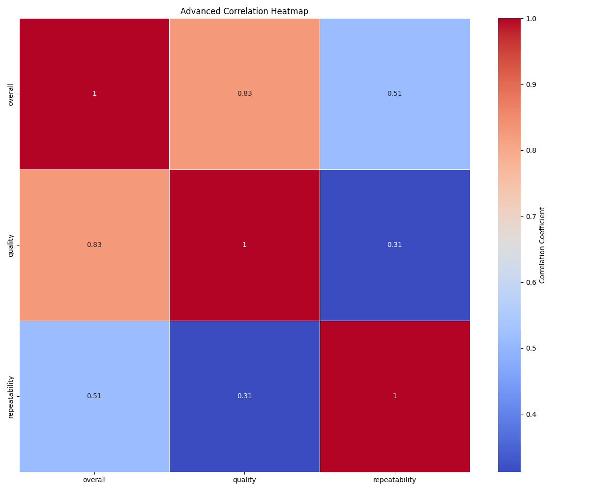
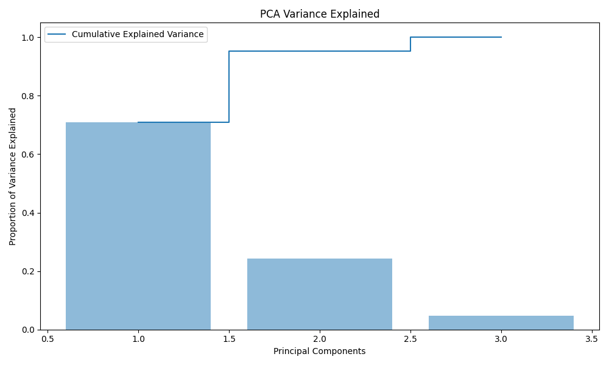
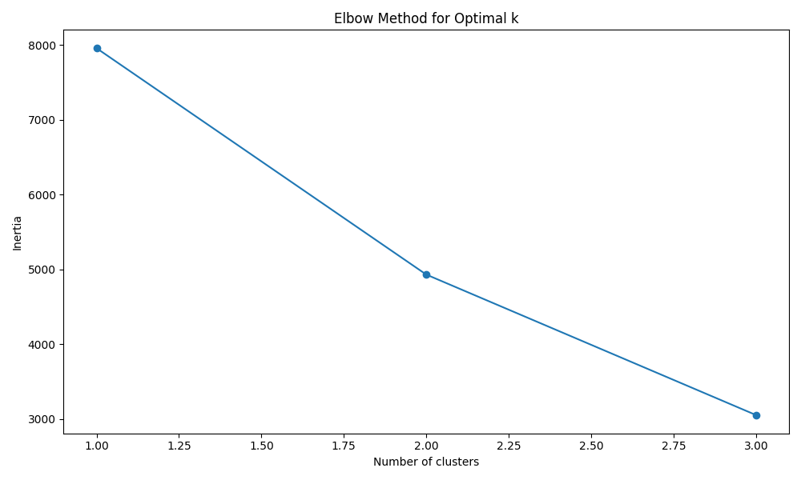
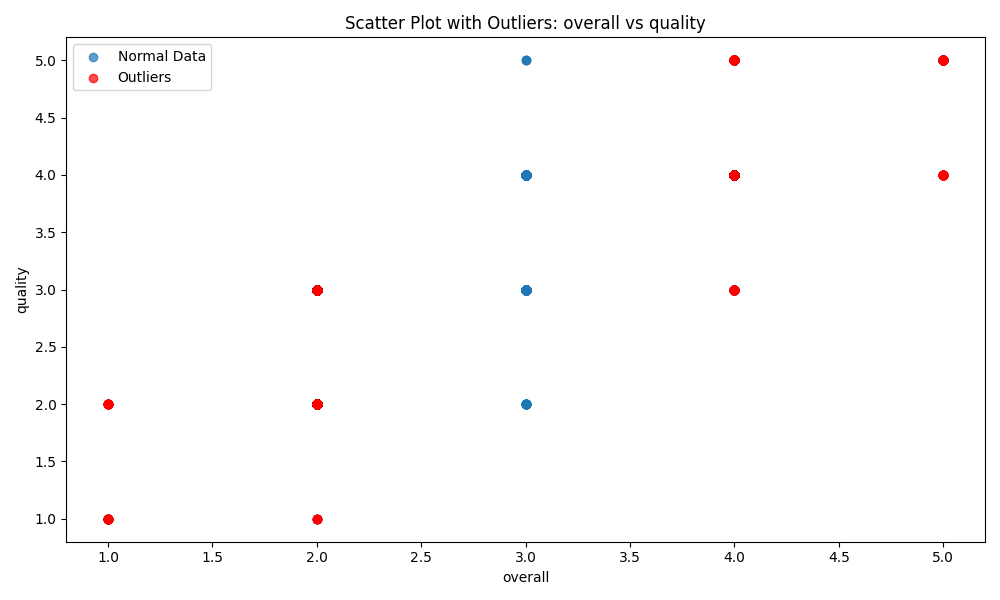

### Unveiling Insights: A Data Story from Diverse Dimensions

In the age of big data, meaningful analysis emerges as a beacon of clarity and insight. Our dataset—a rich collection with **2,652 records** and **eight distinct attributes**—captures a diverse landscape of languages, types, and content ratings. This dataset serves as a crucial tool for stakeholders seeking to understand linguistic diversity and content quality across various categories. With columns that include metrics such as "overall," "quality," and "repeatability," this analysis serves to enhance the usability and interpretation of this information.

#### The Analytical Journey

To extract insights, we employed various analytical techniques: **correlation analysis**, **Principal Component Analysis (PCA)**, **clustering through K-means**, and **outlier detection**. 

1. **Correlation Analysis**:
   The foundational step involved examining relationships among the variables. Using an advanced correlation heatmap (refer to **advanced_correlation_heatmap.png**), we identified significant connections among rating metrics. Notably, the correlation between "overall" and "quality" demonstrated a strong positive relationship. This analysis informs content creators and evaluators of what traits yield higher quality in their offerings.

2. **Principal Component Analysis (PCA)**:
   We employed PCA to distill the data, allowing us to reformulate the dataset into **three main components** that capture **over 95% of the variance**. The significant variance ratios—**70.99%** for the first component, **24.23%** for the second—indicate that much of the data's complexity can be simplified while maintaining its richness. This is visually represented in the **pca_variance_plot.png**, where each component's impact is clear.

3. **Clustering with K-means**:
   To explore natural groupings within the dataset, clustering analysis was used. The K-means algorithm revealed an elbow method indicating optimal clusters, with decreasing inertia values (refer to **kmeans_elbow_plot.png**). This method aids stakeholders in segmenting data effectively for targeted strategies. The identified clusters can inform tailored marketing practices or feature enhancements based on user preferences.

4. **Outlier Detection**:
   Our investigation revealed a concerning **1,216 outliers** in the relationship between "overall" and "quality," as depicted in **scatter_outliers_colX_vs_colY.png**. Identifying these outliers not only highlights potential data inaccuracies but also underscores areas where the expectation significantly deviates from reality—essential for content evaluators aiming to uplift standards.

#### Key Insights and Actionable Outcomes

The analysis yielded several actionable insights:

- **Strengthen Quality Assurance**: The strong correlation between "overall" and "quality" asserts that improving quality measures can directly enhance overall user satisfaction. Regular audits and updates to content could be beneficial.
  
- **Tailored Content Creation**: By leveraging sizable clusters, content creators may be able to refine their offerings to meet distinct audience preferences, thereby maximizing engagement.

- **Prioritize Outlier Analysis**: Outliers should be further examined—whether they indicate extraordinary success or critical failures. Understanding these anomalies can lead to strategic pivots that enhance the overall quality of content.

#### Concluding Implications and Recommendations

The implications of our findings underscore the relevance of data-driven decision-making. As we navigate this landscape, content creators, marketers, and platforms alike can utilize these insights to strengthen their strategies. 

Key recommendations include:

- **Implementing Continuous Quality Improvement Protocols**: Regular assessments based on our findings could help maintain and elevate standards.
  
- **Develop Data-Driven Marketing Strategies**: Use clustering insights to craft focused marketing campaigns, ensuring relevancy and enhancing audience reach.

- **Conducting Periodic Outlier Reviews**: Establish a system to continuously monitor and investigate outliers, ensuring a proactive approach to quality management.

In essence, this analysis not only enlightens our understanding of the dataset but also provides a pathway for future explorations, ensuring that data is not just a collection of numbers, but a powerful ally in driving impactful decisions. As we embrace these insights, we stand on the brink of transformation—equipped to refine our offerings and maximize engagement across diverse languages and content types.

## Detailed Visualizations
### Dataset Overview Visualization

### PCA Variance Plot
This plot shows the explained variance ratio for principal components:

### K-Means Elbow Plot
The elbow method visualization for determining the optimal number of clusters:

### Scatter Plot with Outliers
Outliers detected between overall and quality are highlighted:

